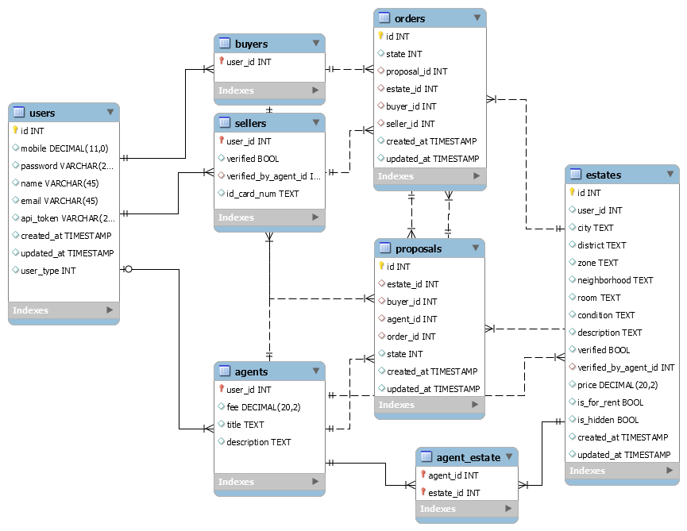

#PDM图

#各表的补充说明

##用户(users)
每个用户都在users表中有记录，users表只用来记录用户的基本信息，如手机号、密码、姓名等等
users表中有一个特别的```user_type```属性，相当于一个内联的ISA，用来区分用户角色，具体是提供方、接受方还是中介。
###user_type的含义
|值|含义|
|-|-|
|0|接受方(buyer)|
|1|提供方(seller)|
|2|中介(agent)|
除此之外还有 ```buyer```, ```seller```, ```agent```这三个表，分别存储了各角色所需的额外字段，他们的主键为```user_id```，必须要和```users```表中的```id```一致。

##提供方(sellers)
提供方需要中介认证，因此有```verified```和```verified_by_agent_id```两个字段，未经过中介认证的将不能发信息。
还可以有一些其他字段，这里模拟，加了个```id_card_num```为身份证号。

##接受方(buyers)
接受方也可以有其他字段，不过暂时没想到能有什么，所以暂时留空。等后面业务逻辑拓展了再加。

##中介(agents)
中介可以设置自己的中介费用```fee```、头衔```title```、介绍```description```。

##房产(estates)
房产基本信息，没有太多要说明的。
```is_for_rent```指示该房产是否为出租，```true```时，```price```为每月租金。false时，隐含房产为出售，```price```为售价。
```is_hidden```为是否从其他接受者中隐藏这个房产。有两种：一是提供方自己撤销，二是中介走完了预定的所有流程，等待接受方付款。

##房产属于中介的多对多关系(agent_estate)
指定哪些房产将由哪些中介负责。用户将在房产详情页面中看到中介的列表。
简单起见，本Project中，每个房产都随机产生5名中介负责。

##预定单(proposals)
由接受方发起，需要指定房产ID、中介ID
state的转换基本都由中介负责（少数由买家负责的除外）

###state

|值|含义|
|-|-|
|0|用户提交了预定，等待中介确认|
|1|中介确认了预定，等待联系卖家|
|2|卖家确认了预定，等待见面|
|3|洽谈成功，等待支付中介费|
|4|中介费支付成功，交易单已生成，房屋信息从网站上撤销|
|-1|预订单被中介拒绝|
|-2|预订单被卖家拒绝|
|-3|洽谈失败，放弃购买|
|-9|预订单被买家取消|


## 交易单(orders)
预订单流程走完后，就会生成交易单
###state

|值|含义|
|-|-|
|0|买家未付房款（卖家可在后台标记）|
|1|买家已付房款，卖家未交货（买家可在后台标记）|
|2|卖家已交货，等待买家确认|
|3|买家已付款，卖家已交货，交易成功|

交易单state的转换由买、卖家双方负责

# 代码

    -- MySQL Workbench Forward Engineering

    SET @OLD_UNIQUE_CHECKS=@@UNIQUE_CHECKS, UNIQUE_CHECKS=0;
    SET @OLD_FOREIGN_KEY_CHECKS=@@FOREIGN_KEY_CHECKS, FOREIGN_KEY_CHECKS=0;
    SET @OLD_SQL_MODE=@@SQL_MODE, SQL_MODE='TRADITIONAL,ALLOW_INVALID_DATES';

    -- -----------------------------------------------------
    -- Schema estate_agent
    -- -----------------------------------------------------

    -- -----------------------------------------------------
    -- Schema estate_agent
    -- -----------------------------------------------------
    CREATE SCHEMA IF NOT EXISTS `estate_agent` DEFAULT CHARACTER SET utf8 ;
    USE `estate_agent` ;

    -- -----------------------------------------------------
    -- Table `estate_agent`.`users`
    -- -----------------------------------------------------
    CREATE TABLE IF NOT EXISTS `estate_agent`.`users` (
      `id` INT NOT NULL AUTO_INCREMENT,
      `mobile` DECIMAL(11,0) NULL,
      `password` VARCHAR(255) NULL,
      `name` VARCHAR(45) NULL,
      `email` VARCHAR(45) NULL,
      `api_token` VARCHAR(255) NULL,
      `created_at` TIMESTAMP NULL,
      `updated_at` TIMESTAMP NULL,
      `user_type` INT NULL,
      PRIMARY KEY (`id`),
      UNIQUE INDEX `mobile_UNIQUE` (`mobile` ASC),
      UNIQUE INDEX `id_UNIQUE` (`id` ASC))
    ENGINE = InnoDB;


    -- -----------------------------------------------------
    -- Table `estate_agent`.`agents`
    -- -----------------------------------------------------
    CREATE TABLE IF NOT EXISTS `estate_agent`.`agents` (
      `user_id` INT NOT NULL,
      `fee` DECIMAL(20,2) NULL,
      `title` TEXT NULL,
      `description` TEXT NULL,
      INDEX `user_id_idx` (`user_id` ASC),
      PRIMARY KEY (`user_id`),
      CONSTRAINT `agent_user`
        FOREIGN KEY (`user_id`)
        REFERENCES `estate_agent`.`users` (`id`)
        ON DELETE NO ACTION
        ON UPDATE NO ACTION)
    ENGINE = InnoDB;


    -- -----------------------------------------------------
    -- Table `estate_agent`.`sellers`
    -- -----------------------------------------------------
    CREATE TABLE IF NOT EXISTS `estate_agent`.`sellers` (
      `user_id` INT NOT NULL,
      `verified` TINYINT(1) NULL,
      `verified_by_agent_id` INT NULL,
      `id_card_num` TEXT NULL,
      PRIMARY KEY (`user_id`),
      INDEX `verified_by_agent_idx` (`verified_by_agent_id` ASC),
      CONSTRAINT `seller_user`
        FOREIGN KEY (`user_id`)
        REFERENCES `estate_agent`.`users` (`id`)
        ON DELETE NO ACTION
        ON UPDATE NO ACTION,
      CONSTRAINT `seller_verified_by_agent`
        FOREIGN KEY (`verified_by_agent_id`)
        REFERENCES `estate_agent`.`agents` (`user_id`)
        ON DELETE NO ACTION
        ON UPDATE NO ACTION)
    ENGINE = InnoDB;


    -- -----------------------------------------------------
    -- Table `estate_agent`.`buyers`
    -- -----------------------------------------------------
    CREATE TABLE IF NOT EXISTS `estate_agent`.`buyers` (
      `user_id` INT NOT NULL,
      INDEX `user_id_idx` (`user_id` ASC),
      PRIMARY KEY (`user_id`),
      CONSTRAINT `buyer_user`
        FOREIGN KEY (`user_id`)
        REFERENCES `estate_agent`.`users` (`id`)
        ON DELETE NO ACTION
        ON UPDATE NO ACTION)
    ENGINE = InnoDB;


    -- -----------------------------------------------------
    -- Table `estate_agent`.`estates`
    -- -----------------------------------------------------
    CREATE TABLE IF NOT EXISTS `estate_agent`.`estates` (
      `id` INT NOT NULL AUTO_INCREMENT,
      `user_id` INT NULL,
      `city` TEXT NULL,
      `district` TEXT NULL,
      `zone` TEXT NULL,
      `neighborhood` TEXT NULL,
      `room` TEXT NULL,
      `condition` TEXT NULL,
      `description` TEXT NULL,
      `verified` TINYINT(1) NULL,
      `verified_by_agent_id` INT NULL,
      `price` DECIMAL(20,2) NULL,
      `is_for_rent` TINYINT(1) NULL,
      `is_hidden` TINYINT(1) NULL,
      `created_at` TIMESTAMP NULL,
      `updated_at` TIMESTAMP NULL,
      PRIMARY KEY (`id`),
      INDEX `verified_by_agent_idx` (`verified_by_agent_id` ASC),
      CONSTRAINT `estate_verified_by_agent`
        FOREIGN KEY (`verified_by_agent_id`)
        REFERENCES `estate_agent`.`agents` (`user_id`)
        ON DELETE NO ACTION
        ON UPDATE NO ACTION)
    ENGINE = InnoDB;


    -- -----------------------------------------------------
    -- Table `estate_agent`.`orders`
    -- -----------------------------------------------------
    CREATE TABLE IF NOT EXISTS `estate_agent`.`orders` (
      `id` INT NOT NULL AUTO_INCREMENT,
      `state` INT NULL,
      `proposal_id` INT NULL,
      `estate_id` INT NULL,
      `buyer_id` INT NULL,
      `seller_id` INT NULL,
      `created_at` TIMESTAMP NULL,
      `updated_at` TIMESTAMP NULL,
      PRIMARY KEY (`id`),
      INDEX `proposal_idx` (`proposal_id` ASC),
      INDEX `estate_idx` (`estate_id` ASC),
      INDEX `seller_idx` (`seller_id` ASC),
      INDEX `buyer_idx` (`buyer_id` ASC),
      CONSTRAINT `order_proposal`
        FOREIGN KEY (`proposal_id`)
        REFERENCES `estate_agent`.`proposals` (`id`)
        ON DELETE NO ACTION
        ON UPDATE NO ACTION,
      CONSTRAINT `order_estate`
        FOREIGN KEY (`estate_id`)
        REFERENCES `estate_agent`.`estates` (`id`)
        ON DELETE NO ACTION
        ON UPDATE NO ACTION,
      CONSTRAINT `order_buyer`
        FOREIGN KEY (`buyer_id`)
        REFERENCES `estate_agent`.`buyers` (`user_id`)
        ON DELETE NO ACTION
        ON UPDATE NO ACTION,
      CONSTRAINT `order_seller`
        FOREIGN KEY (`seller_id`)
        REFERENCES `estate_agent`.`sellers` (`user_id`)
        ON DELETE NO ACTION
        ON UPDATE NO ACTION)
    ENGINE = InnoDB;


    -- -----------------------------------------------------
    -- Table `estate_agent`.`proposals`
    -- -----------------------------------------------------
    CREATE TABLE IF NOT EXISTS `estate_agent`.`proposals` (
      `id` INT NOT NULL AUTO_INCREMENT,
      `estate_id` INT NULL,
      `buyer_id` INT NULL,
      `agent_id` INT NULL,
      `order_id` INT NULL,
      `state` INT NULL,
      `created_at` TIMESTAMP NULL,
      `updated_at` TIMESTAMP NULL,
      PRIMARY KEY (`id`),
      INDEX `estate_idx` (`estate_id` ASC),
      INDEX `order_idx` (`order_id` ASC),
      INDEX `agent_idx` (`agent_id` ASC),
      INDEX `proposal_buyer_idx` (`buyer_id` ASC),
      CONSTRAINT `proposal_estate`
        FOREIGN KEY (`estate_id`)
        REFERENCES `estate_agent`.`estates` (`id`)
        ON DELETE NO ACTION
        ON UPDATE NO ACTION,
      CONSTRAINT `proposal_agent`
        FOREIGN KEY (`agent_id`)
        REFERENCES `estate_agent`.`agents` (`user_id`)
        ON DELETE NO ACTION
        ON UPDATE NO ACTION,
      CONSTRAINT `proposal_order`
        FOREIGN KEY (`order_id`)
        REFERENCES `estate_agent`.`orders` (`id`)
        ON DELETE NO ACTION
        ON UPDATE NO ACTION,
      CONSTRAINT `proposal_buyer`
        FOREIGN KEY (`buyer_id`)
        REFERENCES `estate_agent`.`buyers` (`user_id`)
        ON DELETE NO ACTION
        ON UPDATE NO ACTION)
    ENGINE = InnoDB;


    -- -----------------------------------------------------
    -- Table `estate_agent`.`agent_estate`
    -- -----------------------------------------------------
    CREATE TABLE IF NOT EXISTS `estate_agent`.`agent_estate` (
      `agent_id` INT NOT NULL,
      `estate_id` INT NOT NULL,
      PRIMARY KEY (`agent_id`, `estate_id`),
      INDEX `estate_idx` (`estate_id` ASC),
      CONSTRAINT `agent_estate_agent`
        FOREIGN KEY (`agent_id`)
        REFERENCES `estate_agent`.`agents` (`user_id`)
        ON DELETE NO ACTION
        ON UPDATE NO ACTION,
      CONSTRAINT `agent_estate_estate`
        FOREIGN KEY (`estate_id`)
        REFERENCES `estate_agent`.`estates` (`id`)
        ON DELETE NO ACTION
        ON UPDATE NO ACTION)
    ENGINE = InnoDB;


    SET SQL_MODE=@OLD_SQL_MODE;
    SET FOREIGN_KEY_CHECKS=@OLD_FOREIGN_KEY_CHECKS;
    SET UNIQUE_CHECKS=@OLD_UNIQUE_CHECKS;
